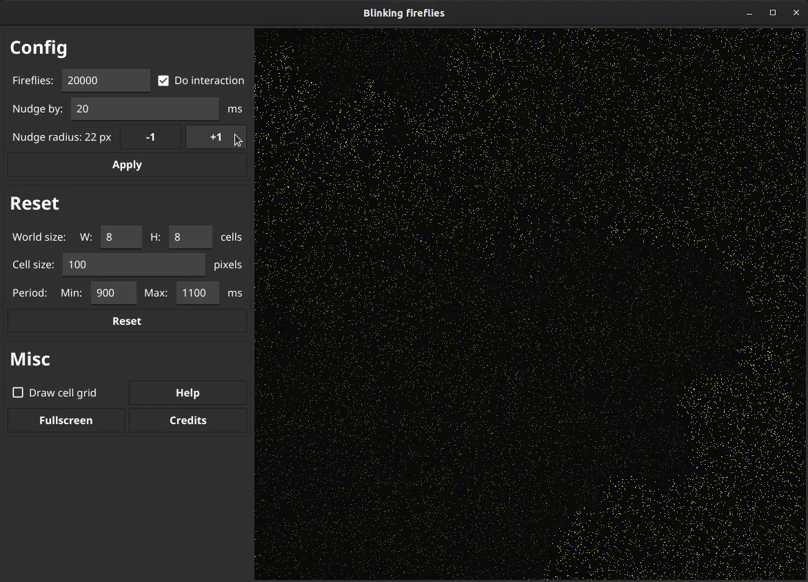

# Firefly simulator

Small scale interactions can lead to large scale organization,
which is super cool.
Veritasium has an excellent
[video](https://www.youtube.com/watch?v=t-_VPRCtiUg)
about this phenomenon.

A simulation of the environment is
[available](https://ncase.me/fireflies/),
and it is even
[open source](https://github.com/ncase/fireflies).
But the size of the swarm can only reach 500.
Rookie numbers.

We want to simulate 1.000.000+ fireflies.

# Sample

Click on the image to see a very blurry video of the simulator in action.

